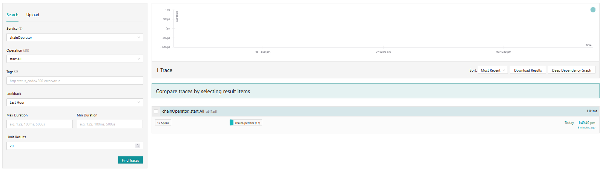
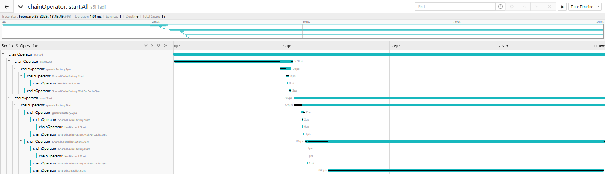
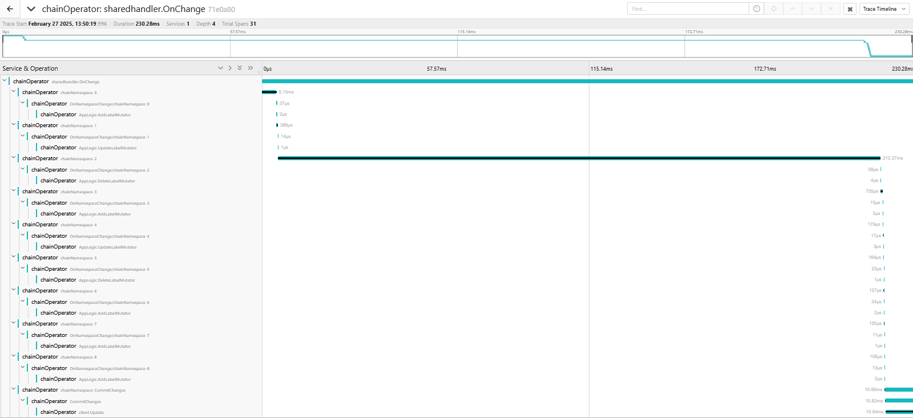

# Tracing Scenario: hierarchy of operations

Controller app logic : `./pkg/app/chain/chain.go`

## Setup

⚠️ The chain operator is stupid (it requeues infinitely) : it is meant to illustrate possibilities with tracing

```bash
docker run --rm --name jaeger \
  -p 16686:16686 \
  -p 4317:4317 \
  -p 4318:4318 \
  -p 5778:5778 \
  -p 9411:9411 \
  jaegertracing/jaeger:2.3.0
```

UI is served on localhost:16686

```bash
make build
KUBECONFIG=$KUBECONFIG ./bin/chain
```

## Instrumentation


wrangler's/lasso's start.All is instrumented to provide a detailed hierarchy of operations:


In more detail for each step:


Shared handler is instrumented with custom spans for app logic they are prefixed with `AppLogic` as the span identifier



Also note the final handler updates the namespace with lasso's `client.Update` which is also instrumented


This demonstrates the base capabilities of instrumenting tracing directly in rancher frameworks to provide better observability into running controllers.